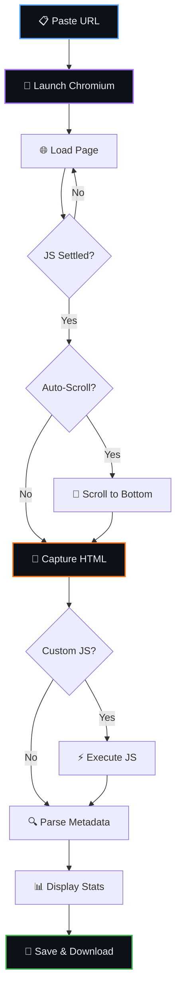

<div align="center">


<br/>

[](https://colab.research.google.com/github/festverse/Z-Web-Scraper/blob/main/notebook/Z-Web-Scraper.ipynb)
[](GUIDE.md)

<br/>

[](https://github.com/festverse/Z-Web-Scraper/stargazers)
[](https://github.com/festverse/Z-Web-Scraper/network/members)
[](https://github.com/festverse/Z-Web-Scraper/issues)
[](https://github.com/festverse/Z-Web-Scraper/commits/main)
[](https://github.com/festverse/Z-Web-Scraper)

<br/>

[](https://www.selenium.dev/)
[](https://www.chromium.org/)
[](https://www.python.org/)
[](LICENSE)

<br/>

**No setup. No install. Just paste a URL and scrape.**

Open notebook in Google Colab, run all cells, and capture the full rendered HTML from any website — even JavaScript-heavy SPAs.

**Tags:** `web-scraping` `selenium` `chromium` `spa-scraper` `colab-notebook` `python` `html-extraction`

</div>

---

## 📑 Table of Contents

<details open>
<summary><b>Quick Navigation</b></summary>

<br/>

| Section | Description |
|:--------|:------------|
| [📖 Overview](#-overview) | What is Z-Web-Scraper? |
| [📂 Project Structure](#-project-structure) | Repository layout |
| [🧩 Architecture](#-architecture) | Pipeline flow diagram |
| [⚙️ Pipeline Components](#️-pipeline-components) | Tools and engines used |
| [🚀 Quick Start](#-quick-start) | Get running in 3 steps |
| [🎛️ Scrape Parameters](#️-scrape-parameters) | All configurable options |
| [📐 Timeout Guide](#-timeout-guide) | When to use which settings |
| [🧠 Scraper Details](#-scraper-details) | Technical specs of each component |
| [🔋 Resource Requirements](#-resource-requirements) | RAM, disk specs |
| [🐍 Python Modules](#-python-modules) | Modular source code reference |
| [🧪 Tips & Tricks](#-tips--tricks) | Get the best results |
| [❓ FAQ](#-faq) | Common questions answered |
| [🐛 Troubleshooting](#-troubleshooting) | Fix common issues |
| [🙏 Acknowledgements](#-acknowledgements) | Credits and references |
| [🤝 Contributing](#-contributing) | How to contribute |
| [📜 License](#-license) | MIT license details |

</details>

---

## 📖 Overview

Z-Web-Scraper is a **full-page web scraper** for Google Colab that uses Selenium with headless Chromium to render any webpage — including JavaScript-heavy single-page applications — and capture the complete HTML after all dynamic content has loaded.

> [!NOTE]
> **Why Selenium + Chromium?** Unlike `requests` or `urllib`, Selenium runs a real browser. This means JavaScript frameworks (React, Vue, Angular, Next.js, Nuxt) execute fully before the HTML is captured. You get what the user sees, not what the server initially sends.

### ✨ Key Features

| Feature | Description |
|---------|-------------|
| 🕷️ **Full Render** | Captures HTML after complete JS execution |
| 📜 **Auto-Scroll** | Scrolls to trigger lazy-loaded content |
| ⚡ **Custom JS** | Execute your own JavaScript after load |
| 🔗 **Link Extraction** | All links with text and resolved URLs |
| 🖼️ **Image Extraction** | All images with alt text and dimensions |
| 🏷️ **Meta Tags** | Open Graph, Twitter Cards, description, keywords |
| 📄 **HTML Preview** | Syntax-highlighted preview in notebook |
| 💾 **Save & Download** | HTML + metadata JSON, ZIP export |

### 📦 What's Included

| Component | File | Purpose |
|-----------|------|---------|
| **Notebook** | `notebook/Z-Web-Scraper.ipynb` | 3-cell Colab notebook — main entry point |
| **Config** | `src/config.py` | Constants, Chrome options, UI theme tokens |
| **Scraper** | `src/scraper.py` | Selenium engine with auto-scroll, metadata extraction |
| **UI** | `src/ui.py` | Theme-safe Colab components (dark/light mode) |
| **Guide** | `GUIDE.md` | Beginner-friendly user guide |

---

## 📂 Project Structure

```
Z-Web-Scraper/
├── CHANGELOG.md                # Version history (newest first)
├── CONTRIBUTING.md             # How to contribute
├── GUIDE.md                    # Beginner-friendly user guide
├── LICENSE                     # MIT
├── README.md                   # This file
├── SECURITY.md                 # Vulnerability reporting policy
├── .gitignore                  # Python, Jupyter, output files, OS artifacts
├── requirements.txt            # Python dependencies
│
├── .github/
│   ├── ISSUE_TEMPLATE/
│   │   ├── bug_report.md
│   │   └── feature_request.md
│   └── PULL_REQUEST_TEMPLATE.md
│
├── notebook/
│   └── Z-Web-Scraper.ipynb          # Main Colab notebook (3 cells)
│
└── src/
    ├── __init__.py             # Package marker + shared exports
    ├── config.py               # Constants and defaults
    ├── scraper.py              # Core scraping engine
    └── ui.py                   # Colab UI components
```

---

## 🧩 Architecture



---

## ⚙️ Pipeline Components

| Component | Technology | Purpose |
|-----------|-----------|---------|
| **Browser Engine** | Chromium (headless) | Renders JavaScript, executes SPAs |
| **Automation** | Selenium WebDriver | Controls Chromium programmatically |
| **HTML Parser** | BeautifulSoup + lxml | Extracts links, images, meta tags |
| **HTTP Fallback** | requests | Fetches response headers |

---

## 🚀 Quick Start

<div align="center">

[](https://colab.research.google.com/github/festverse/Z-Web-Scraper/blob/main/notebook/Z-Web-Scraper.ipynb)

</div>

| Step | Cell | What Happens | Duration |
|:----:|------|-------------|----------|
| 🔧 | **1. Setup** | Install Chromium & Selenium | ~60s (first) / ~10s (cached) |
| 🕷️ | **2. Scrape** | Paste URL → render → capture HTML | ~5–60s per page |
| 💾 | **3. Export** | Zip and download results | ~5 sec |

---

## 🎛️ Scrape Parameters

| Parameter | Type | Default | Options | Description |
|-----------|------|---------|---------|-------------|
| `url` | String | — | Any URL | Website to scrape |
| `timeout` | Integer | `30` | `10`–`120` | Max seconds to wait for page load |
| `wait_after_load` | Integer | `3` | `0`–`30` | Extra seconds for JS to settle |
| `auto_scroll` | Bool | `True` | `True`/`False` | Scroll to trigger lazy content |
| `custom_js` | String | `""` | Any JS | JavaScript to execute after load |
| `save_html_file` | Bool | `True` | `True`/`False` | Save HTML to file |
| `show_preview` | Bool | `True` | `True`/`False` | Display syntax-highlighted preview |
| `show_links` | Bool | `True` | `True`/`False` | Extract and display all links |

---

## 📐 Timeout Guide

| Site Type | Timeout | Wait After | Auto-Scroll | Speed |
|:---------:|:-------:|:----------:|:-----------:|:-----:|
| **Static HTML** | 15s | 1s | Optional | ⚡⚡⚡ |
| **React / Vue SPA** | 30s | 3–5s | Yes | ⚡⚡ |
| **Next.js / Nuxt** | 60s | 5–8s | Yes | ⚡ |
| **Heavy Media** | 90–120s | 5–10s | Yes | 🐢 |

---

## 🧠 Scraper Details

### Selenium + Chromium

| Property | Value |
|----------|-------|
| **Engine** | Chromium (headless, `--headless=new`) |
| **Driver** | Selenium WebDriver 4.x |
| **Window** | 1920×1080 |
| **User Agent** | Chrome 125 (Windows) |
| **Timeout** | Configurable 10–120 seconds |
| **Source** | [selenium.dev](https://www.selenium.dev/) |

### BeautifulSoup + lxml

| Property | Value |
|----------|-------|
| **Purpose** | HTML parsing and data extraction |
| **Extracts** | Links, images, meta tags, text |
| **Parser** | lxml (fast C-based) |
| **Source** | [crummy.com/BeautifulSoup](https://www.crummy.com/software/BeautifulSoup/) |

---

## 🔋 Resource Requirements

| Resource | Minimum | Recommended | Notes |
|----------|---------|-------------|-------|
| **Runtime** | Colab free | Colab free | No GPU needed |
| **System RAM** | 2 GB | 4 GB+ | Chromium memory |
| **Disk Space** | 500 MB | 1 GB+ | Chromium + outputs |
| **Python** | 3.10+ | Colab default | Required for Selenium |

---

## 🐍 Python Modules

### `src/config.py`
```python
from src.config import DEFAULT_TIMEOUT, CHROME_OPTIONS, BG_CARD
print(f"Default timeout: {DEFAULT_TIMEOUT}s")
```

### `src/scraper.py`
```python
from src.scraper import scrape_url, save_html, extract_links
result = scrape_url("https://example.com", timeout=30, scroll=True)
save_html(result["html"], "output.html")
links = extract_links(result["html"], result["final_url"])
```

### `src/ui.py`
```python
from src.ui import show_header, show_ok, show_stats
show_header("🕷️", "Scraping", "Loading page...")
show_ok("Page captured!")
show_stats([("📄", "Chars", "125,000"), ("🔗", "Links", "42")])
```

---

## 🧪 Tips & Tricks

<table>
<tr>
<td width="50%" valign="top">

### 🌐 Input Quality
- **Use full URLs** — include `https://` for best results
- **Increase timeout** for slow servers (60–120s)
- **Custom JS** can click expand buttons or trigger modals

</td>
<td width="50%" valign="top">

### ⚡ Performance
- **Disable auto-scroll** if you only need above-the-fold content
- **Lower wait_after_load** for static sites (1s is enough)
- **Batch scraping** — run Step 2 multiple times, export once

</td>
</tr>
<tr>
<td width="50%" valign="top">

### 🎯 SPA-Specific
- **Next.js / Nuxt** — increase wait to 5–8s for SSG/SSR
- **Infinite scroll** — auto-scroll handles it automatically
- **Client-side routing** — paste the final URL, not the shell

</td>
<td width="50%" valign="top">

### 📤 Output
- **HTML file** — complete rendered DOM, ready for parsing
- **Metadata JSON** — title, tags, stats, hash for dedup
- **ZIP export** — download everything at once

</td>
</tr>
</table>

---

## ❓ FAQ

<details>
<summary><b>Does it work on Next.js / React / Vue sites?</b></summary>

Yes! Selenium runs a real Chromium browser, so all JavaScript frameworks execute fully before the HTML is captured.
</details>

<details>
<summary><b>Can I scrape pages behind login?</b></summary>

Not directly. You could inject cookies via `custom_js`, but there's no built-in auth flow.
</details>

<details>
<summary><b>Why not just use `requests`?</b></summary>

`requests` only gets the initial server response — no JavaScript execution. SPAs return an empty shell that gets filled by JS. Selenium renders the full page.
</details>

<details>
<summary><b>Is GPU required?</b></summary>

No. Z-Web-Scraper runs entirely on CPU. Chromium doesn't need GPU acceleration for scraping.
</details>

<details>
<summary><b>Can I scrape multiple URLs?</b></summary>

Yes! Run Step 2 multiple times with different URLs. All files accumulate in the output directory and can be exported together in Step 3.
</details>

<details>
<summary><b>How big can the HTML be?</b></summary>

There's no hard limit. Very large pages (10+ MB HTML) may slow down the preview. The full HTML is always saved to file regardless of size.
</details>

---

## 🐛 Troubleshooting

| Problem | Cause | Solution |
|---------|-------|----------|
| `Chromium not found` | Runtime restarted | Re-run Cell 1 |
| `TimeoutException` | Page too slow | Increase `timeout` to 60–120s |
| Empty HTML | JS not settled | Increase `wait_after_load` to 5–10s |
| Missing lazy content | Scroll not triggered | Enable `auto_scroll` |
| `WebDriverException` | Driver crash | Restart runtime, re-run Cell 1 |
| `ConnectionRefused` | Site blocks bots | Try different URL or add delay |

---

## 🙏 Acknowledgements

<table>
<tr>
<td width="50%" valign="top">

### 🛠️ Tools
- [Selenium](https://www.selenium.dev/) — Browser automation
- [BeautifulSoup](https://www.crummy.com/software/BeautifulSoup/) — HTML parsing
- [Chromium](https://www.chromium.org/) — Browser engine
- [Google Colab](https://colab.research.google.com/) — Free cloud runtime

</td>
<td width="50%" valign="top">

### 📚 Libraries
- [lxml](https://lxml.de/) — Fast XML/HTML parser
- [requests](https://requests.readthedocs.io/) — HTTP library
- [PyCapsule Render](https://github.com/kyechan99/capsule-render) — README header

</td>
</tr>
</table>

---

## 🤝 Contributing

Contributions are welcome!

<table>
<tr>
<td width="33%" align="center">

### 🐛 Report Bugs
[Open an Issue](https://github.com/festverse/Z-Web-Scraper/issues)

</td>
<td width="33%" align="center">

### 💡 Suggest Features
[Start a Discussion](https://github.com/festverse/Z-Web-Scraper/issues)

</td>
<td width="33%" align="center">

### 🔀 Submit PRs
[Fork & Submit](https://github.com/festverse/Z-Web-Scraper/fork)

</td>
</tr>
</table>

---

## 📜 License

<div align="center">

[](LICENSE)

This project is licensed under the **MIT License**.

Free to use, modify, and distribute — see the [LICENSE](LICENSE) file for details.

</div>

---

## 💕 Loved My Work?
🚨 [Follow me on GitHub](https://github.com/festverse)

⭐ [Give a star to this project](https://github.com/festverse/Z-Web-Scraper)

<div align="center">
  
<a href="https://github.com/festverse/Z-Web-Scraper">

</a>

<i>~ For inquiries or collaborations</i>
     
[](https://telegram.me/festverse "Contact on Telegram")
[](https://instagram.com/festverse_ "Follow on Instagram")
[](mailto:fest.payhip@gmail.com "Send an Email")

<sup><b>Copyright © <a href="https://telegram.me/festverse">Utsav Vasava</a> All Rights Reserved</b></sup>

</div>
